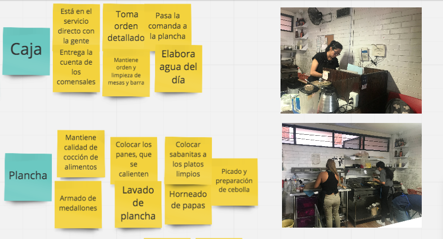
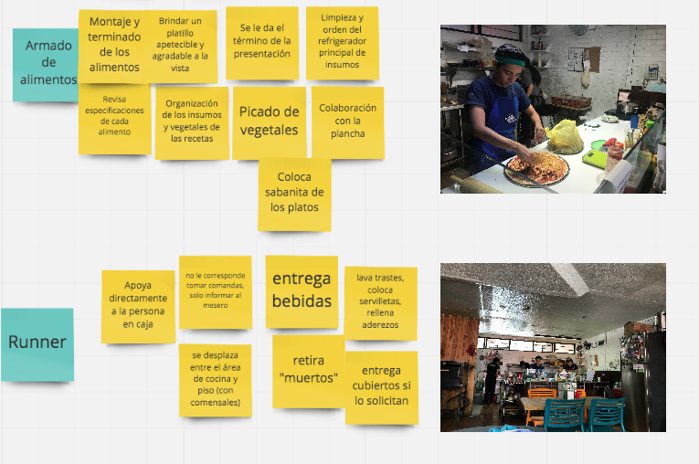
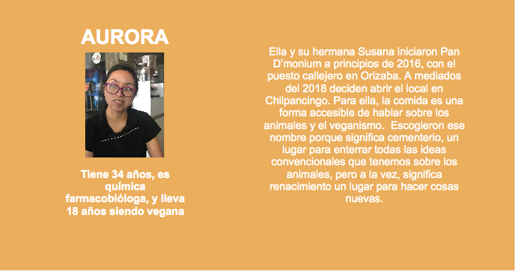

# Preámbulo

Nos contactó una cadena de comida rápida vegana (Pan D’monium, ubicado en Av. Chilpancingo 129, colonia Roma Sur) para que contruyamos una interfaz para optimizar toma de pedidos y administración dentro de su local establecido.

# Conocimiento del negocio

Para conocer cómo se realizan los pedidos y las necesidades del personal para la atención de los comensales, acudimos a las instalaciones de Pan D'monium. Fuimos atendidas por Aurora, dueña del negocio, quien nos explicó las estaciones en que se divide el negocio. Nos habló de las dificultades para utilizar el software y las repercusiones en su trabajo.

En Pan D'monium trabajan 5 personas trabajan en este local establecido, todas mayormente en la cocina, por lo que cuando entran comensales, una de ellas tiene que parar lo que está haciendo para ir a atender las mesas, para regresar con el pedido y seguir preparando la comida. No hay una persona enteramente dedicada a meserear. Descubrimos que tienen promoción de pizzas al 2x1 para los días miércoles y que tienen muchas visitas ese día de la semana.

El menú de Pan D'moium ofrece 6 tipos de hamburguesas, 6 diferentes pizzas, con 3 tamaños (personal, mediana y familiar), así mismo 2 tipos de ensaladas, sodas italianas, malteadas y postres, pero no cuenta con opción en inglés.

## Entrevista con Aurora

#Entendimiento del problema

El negocio usa desde hace 6 meses la aplicación iZettle, usan además una impresora para que las comandas lleguen a cada estación en la cocina, y una terminal para realizar los cobros con tarjeta.

La aplicación le permite crear un mapa con la distribución real de las mesas del local, sin embargo, nos comenta esto le quita tiempo.

El sistema le permite ingresar todas las opciones de su menú, tanto comida como bebidas, y una característica que le agrada es poder poner especificaciones en las comandas (productos sin algún condimento o pizzas con de dos estilos diferentes).

Una vez que la orden está lista se manda a cocina y ahí se imprime la comanda, en caso de que la orden incluya productos de diferentes estaciones se imprime las veces que sean necesarias.

